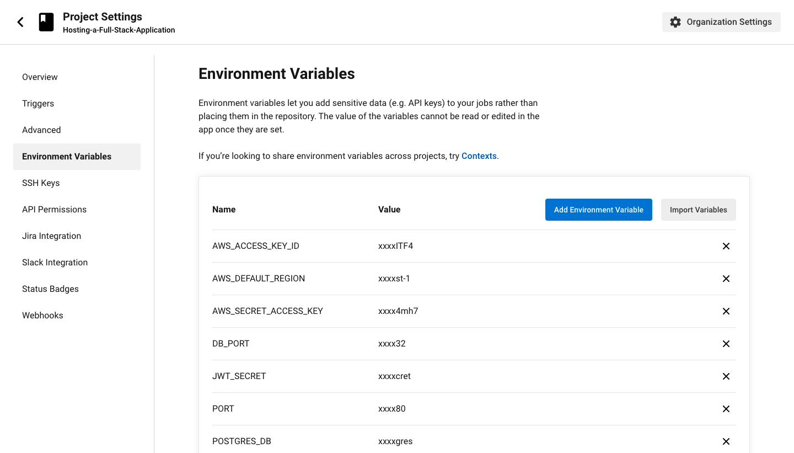

# Pipeline process

* Install all Bakend dependencies.
* Build application Bakend app.
* Deploy build Bakend app to Elastic Beanstalk.

* Install all Frontend dependencies.
* Run tests Frontend app.
* Build application Frontend app.
* Deploy Frontend app folder to S3.

### Circleci Pipeline

## Circleci image

## ENV Circleci image

