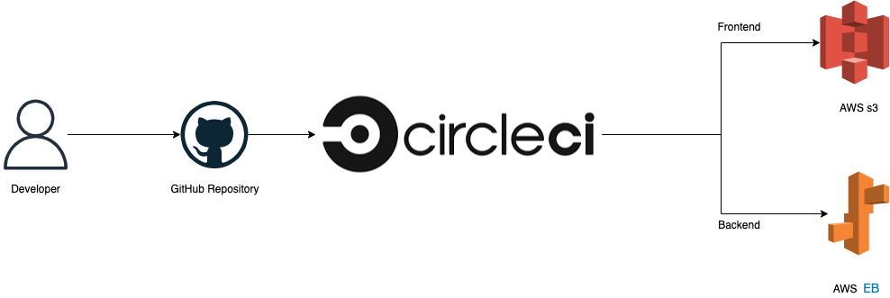

# Udagram

This application is provided to you as an alternative starter project if you do not wish to host your own code done in the previous courses of this nanodegree. The udagram application is a fairly simple application that includes all the major components of a Full-Stack web application.

## This project is composed of Frontend and Backend.

* Backend ur: http://backend-hosting-a-full-stack-application.us-east-1.elasticbeanstalk.com/api/v0
* Frontend ur: http://frontend-s3-hosting-a-full-stack-application.s3-website-us-east-1.amazonaws.com/home

### Backend commands:

1. `"install:API": "cd udagram-api-ready && npm install",`
2. `"build:API": "cd udagram-api-ready && npm run build",`
3. `"deploy:API": "cd udagram-api-ready && npm run deploy",`

### Frontend commands:

- `"install:Frontend": "cd udagram-frontend-ready && npm install",`
- `"test:Frontend": "cd udagram-frontend-ready && npm run test",`
- `"e2e:Frontend": "cd udagram-frontend-ready && npm run e2e",`
- `"build:Frontend": "cd udagram-frontend-ready && npm run build",`
- `"deploy:Frontend": "cd udagram-frontend-ready && npm run deploy"`


### Pipeline process

* Install all Bakend dependencies.
* Build application Bakend app.
* Deploy build Bakend app to Elastic Beanstalk.

* Install all Frontend dependencies.
* Run tests Frontend app.
* Build application Frontend app.
* Deploy Frontend app folder to S3.

### Circleci Pipeline



### AWS infrastructure


## Dependencias

### Backend

- Elastic Beanstalk CLI.
- An Elastic Beanstalk environment.
- A RDS database running Postgres.

```json
"dependencies": {
    "@types/bcrypt": "^3.0.0",
    "@types/jsonwebtoken": "^8.3.2",
    "aws-sdk": "^2.429.0",
    "bcrypt": "^5.0.1",
    "body-parser": "^1.18.3",
    "cors": "^2.8.5",
    "dotenv": "^8.2.0",
    "email-validator": "^2.0.4",
    "express": "^4.16.4",
    "jsonwebtoken": "^8.5.1",
    "pg": "^8.7.1",
    "reflect-metadata": "^0.1.13",
    "sequelize": "^5.21.4",
    "sequelize-typescript": "^0.6.9"
  },
  "devDependencies": {
    "@types/bluebird": "^3.5.26",
    "@types/cors": "^2.8.6",
    "@types/express": "^4.16.1",
    "@types/node": "^11.11.6",
    "@types/sequelize": "^4.27.44",
    "@types/validator": "^10.9.0",
    "@typescript-eslint/eslint-plugin": "^2.19.2",
    "@typescript-eslint/parser": "^2.19.2",
    "chai": "^4.2.0",
    "chai-http": "^4.2.1",
    "eslint": "^6.8.0",
    "eslint-config-google": "^0.14.0",
    "mocha": "^6.1.4",
    "ts-node-dev": "^1.0.0-pre.32",
    "typescript": "^3.3.4000"
  },
  "engines" : { "node" : "=14.15.1" }
```

### Frontend

- AWS CLI v2.
- A S3 bucket for hosting.

```json
"dependencies": {
    "@angular/common": "^8.2.14",
    "@angular/core": "^8.2.14",
    "@angular/forms": "^8.2.14",
    "@angular/http": "^7.2.2",
    "@angular/platform-browser": "^8.2.14",
    "@angular/platform-browser-dynamic": "^8.2.14",
    "@angular/router": "^8.2.14",
    "@ionic-native/core": "^5.0.0",
    "@ionic-native/splash-screen": "^5.0.0",
    "@ionic-native/status-bar": "^5.0.0",
    "@ionic/angular": "^4.1.0",
    "core-js": "^2.5.4",
    "rxjs": "~6.5.4",
    "zone.js": "~0.9.1"
  },
  "devDependencies": {
    "@angular-devkit/architect": "~0.12.3",
    "@angular-devkit/build-angular": "^0.803.24",
    "@angular-devkit/core": "~7.2.3",
    "@angular-devkit/schematics": "~7.2.3",
    "@angular/cli": "~8.3.25",
    "@angular/compiler": "~8.2.14",
    "@angular/compiler-cli": "~8.2.14",
    "@angular/language-service": "~8.2.14",
    "@ionic/angular-toolkit": "~1.4.0",
    "@types/jasmine": "~2.8.8",
    "@types/jasminewd2": "~2.0.3",
    "@types/node": "~10.12.0",
    "@typescript-eslint/eslint-plugin": "^2.20.0",
    "@typescript-eslint/parser": "^2.20.0",
    "codelyzer": "~4.5.0",
    "jasmine-core": "~2.99.1",
    "jasmine-spec-reporter": "~4.2.1",
    "karma": "~3.1.4",
    "karma-chrome-launcher": "~2.2.0",
    "karma-coverage-istanbul-reporter": "~2.0.1",
    "karma-jasmine": "~1.1.2",
    "karma-jasmine-html-reporter": "^0.2.2",
    "protractor": "^7.0.0",
    "ts-node": "~8.0.0",
    "tslint": "~5.12.0",
    "typescript": "^3.5.3"
  },
```
